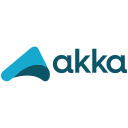

# 👋 Hello, I'm Igor Buzian

Full-Stack Developer | Backend-focused

I build scalable, high-performance backend systems and maintain clean, maintainable frontend code. My background includes professional Unity development and extensive experience with enterprise Java frameworks.

---
## 🛠️ Tech Stack
### Backend (Java Ecosystem)
<table>
  <tr>
    <td align="center" width="96">
       
      Java
    </td>
    <td align="center" width="96">
       
      Spring Framework
    </td>
    <td align="center" width="96">
       
      Hibernate
    </td>
    <td align="center" width="96">
       
      Quarkus
    </td>
    <td align="center" width="96">
       
      Kafka
    </td>
  </tr>
  <tr>
    <td align="center" width="96">
       
      Spring Boot
    </td>
    <td align="center" width="96">
       
      Spring Batch
    </td>
    <td align="center" width="96">
     
      Vaadin
    </td>
    <td align="center" width="96">
       
      JasperReports
    </td>
    <td align="center" width="96">
       
      Akka
    </td>
  </tr>
</table>

### Frontend
<table>
  <tr>
    <td align="center" width="96">
       
      Angular
    </td>
    <td align="center" width="96">
       
      TypeScript
    </td>
    <td align="center" width="96">
       
      JavaScript
    </td>
  </tr>
</table>

### Tools & Other
<table>
  <tr>
    <td align="center" width="96">
       
      Docker
    </td>
    <td align="center" width="96">
       
      Kubernetes
    </td>
    <td align="center" width="96">
       
      Jenkins
    </td>
    <td align="center" width="96">
       
      Git
    </td>
    <td align="center" width="96">
       
      Unity
    </td>
  </tr>
</table>

---

## 📂 Projects

### 🎯 [MVP Vaadin Spring Project](https://github.com/Igor-Buzian/MVP-Vaadin-Spring-Project)  
**Tech:** Java, Spring Boot, Vaadin, REST, Microservices  
Modular full-stack application with layered architecture (`core`, `shared`, `backend`, `frontend`, `application`). Features JWT-based authentication, brute-force protection, and safeguards against login enumeration attacks.

### 💻 [Management Dashboard](https://github.com/Igor-Buzian/Management_Dashboard)  
**Tech:** Angular, TypeScript, RxJS, Spring Boot, H2, REST API  
Responsive admin dashboard with user CRUD, search filter, and role-based menu. Implements reactive form validation, modular components, and a maintainable architecture.

### 🎮 [Frogotten Kingdom](https://frogotten-king.itch.io/frogotten-kingdom)  
**Tech:** C# (Unity)  
Retro platformer using free assets, featuring diverse enemy types, multiple bosses, and challenging, engaging levels.

> More projects available in my repositories.

---

## 💡 Key Skills & Expertise

- Backend system design and architecture  
- Scalable and distributed systems  
- Event-driven & asynchronous programming  
- Database design and optimization  
- Clean architecture and best practices  
- RESTful APIs, GraphQL  
- Microservices, Spring ecosystem, Quarkus  
- Modular front-end development with Angular and Vaadin  

---

## 🏆 Achievements & Highlights

- Designed and implemented secure, JWT-based authentication systems  
- Built modular, maintainable full-stack architectures  
- Developed responsive dashboards and interactive UI components  
- Created engaging gameplay mechanics with object-oriented Unity design  

---

## 📫 Contact

- [LinkedIn](https://www.linkedin.com/in/your-profile)  
- [Email](mailto:igoribuzian@gmail.com)  
- Open for collaboration, code reviews, and challenging projects 🚀
